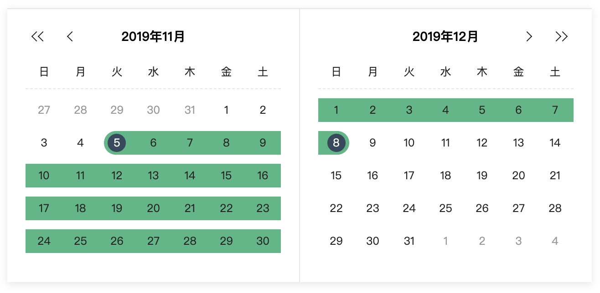
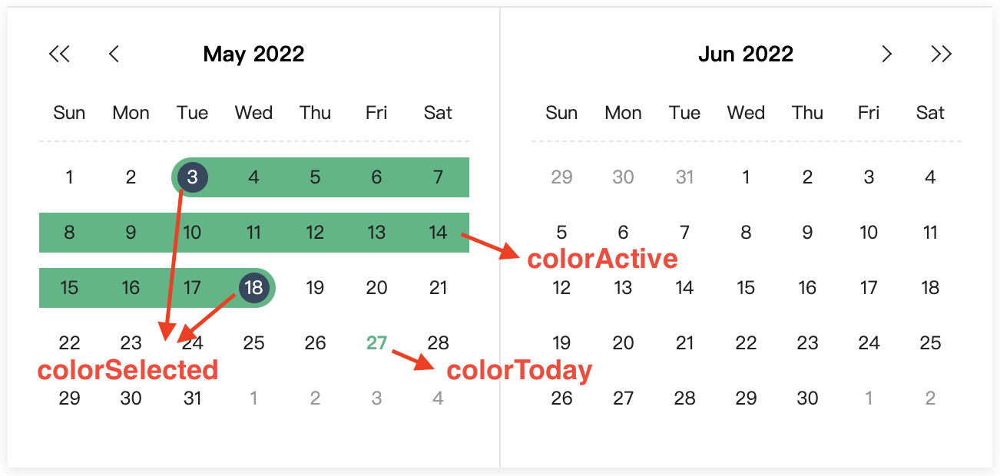

# vue-easy-range-date-picker

> A simple and easy-to-use range datepicker based on Vue2

# Installation

```bash
npm install --save vue-easy-range-date-picker
```
# Demo


[](https://codesandbox.io/s/vue-template-kgm6v?file=/src/App.vue)


# Usage

## ES6 Modules

```js
import RangeDatePicker from 'vue-easy-range-date-picker';
```

```html
<range-date-picker v-model="dates"/>
```

# Props API
| Props                | Type         | Required | Default     |
| ---------------------| -------------| -------- | ------------|
| v-model(1)           | Object       | yes      | null        |
| language(2)          | String       | no       | 'zh'        |
| colorToday(3)        | String       | no       | '#41b883'   |
| colorSelected(3)     | String       | no       | '#34495e'   |
| colorActive(3)       | String       | no       | '#41b883'   |

(1) v-model: Bind to an Object which contains start timestamp and end timestamp: 
```js
// example
dates: { 
  start: 1573052400000,
  end: 1574434800000
}
```
you can also pass an empty object as the default value like this:
```html
<range-date-picker v-model="{}"/>
```
(2) Now supporting Chinese('zh'), Japanese('jp'), English('en')

(3)



# Events

`closePicker` event will be emitted when both the start date and end date are selected.

# Build Setup
``` bash
# install dependencies
npm install
# serve with hot reload at localhost:8080
npm run dev
# build for production with minification
npm run build
```


